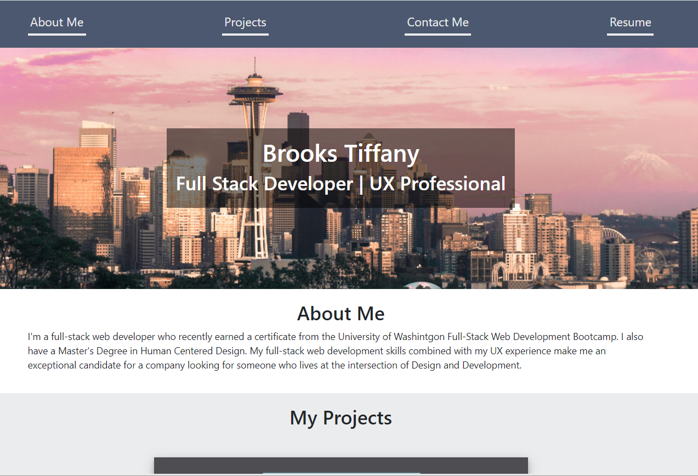

# PROFESSIONAL PORTFOLIO BUILT WITH REACT

## DESCRIPTION 
This portfolio is built with React and is meant to showcase what I've learned so far in the UW Coding Bootcamp. I'll continue to update and polish this over the coming months.

## USAGE
- Use the header nav links to jump to a section of the portfolio.
- Access my resume with the resume link in the top-right of the header.
- Click on any of the projects to be the active app for any of the projects.
- Find my contact information in the footer of the website to include my GitHub.

Link: https://brooks-t.github.io/professional-portfolio/

